# MLOPs Assignment 01
## Amna Salahudin - (20I - 0488), Muqadas Zulfiqar - (20I - 1838)

## Branch Protection Rules
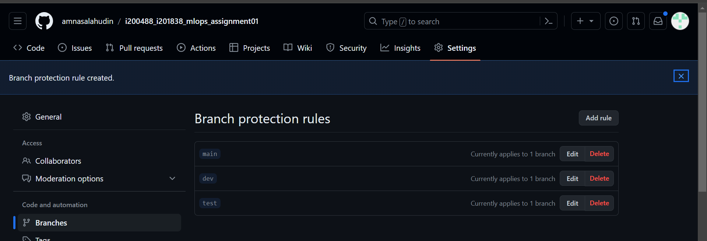

## Adding New Feature
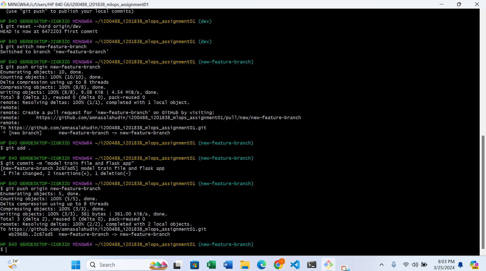

## PR for Merging new-feature-branch to dev branch
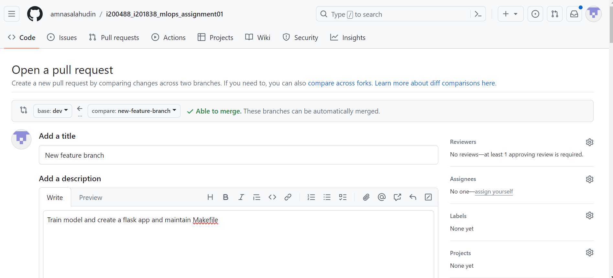

## Checks Passed (Code Quality Check) and Changes Approved to merge to dev branch
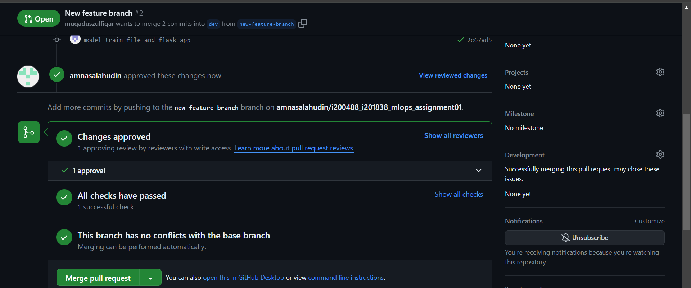

## Feature Branch Merged to Dev Branch
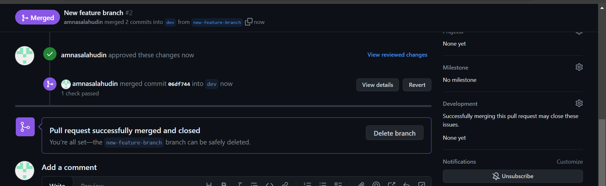

## PR for Merging dev branch to test branch
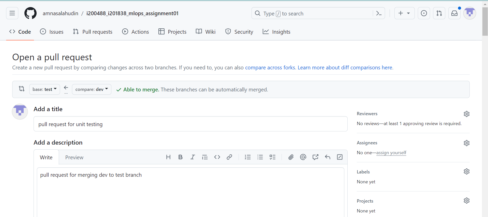

## Checks Passed (Automated Testing) and Changes Approved to merge to test branch
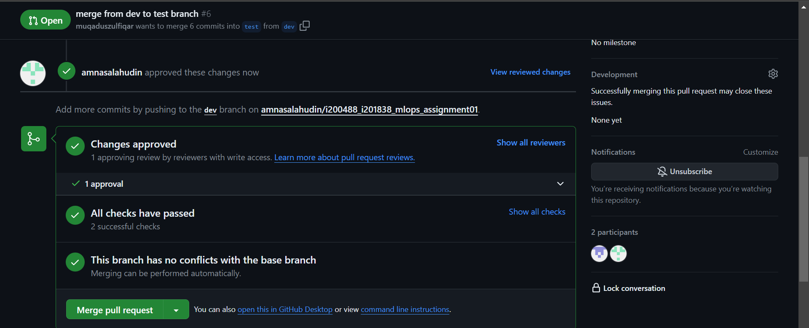

## Dev Branch Merged to test Branch
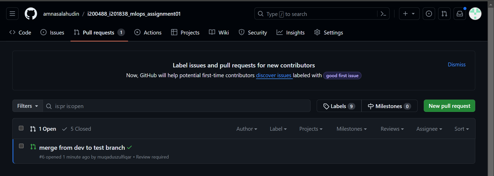

## PR for Merging test branch to main branch
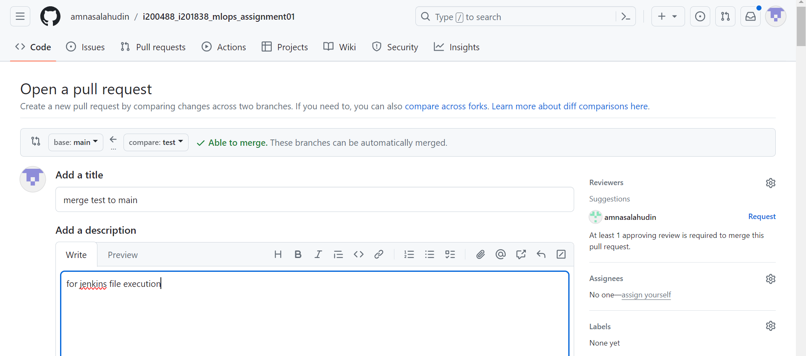

## Changes Approved to merge to main branch
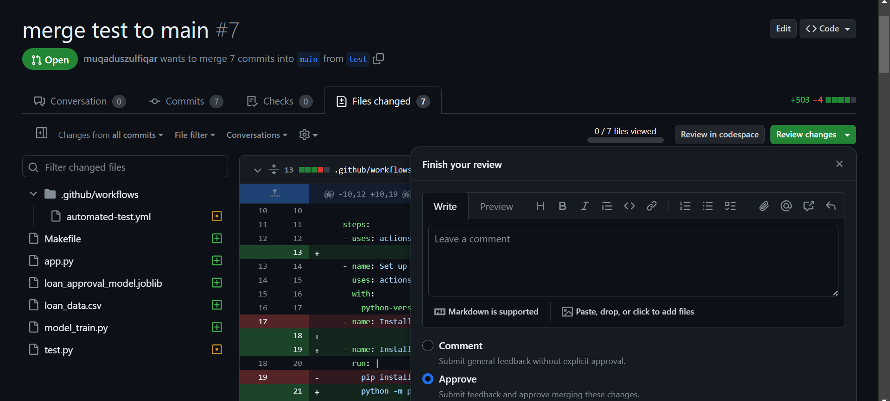

## Test Branch Merged to Main Branch
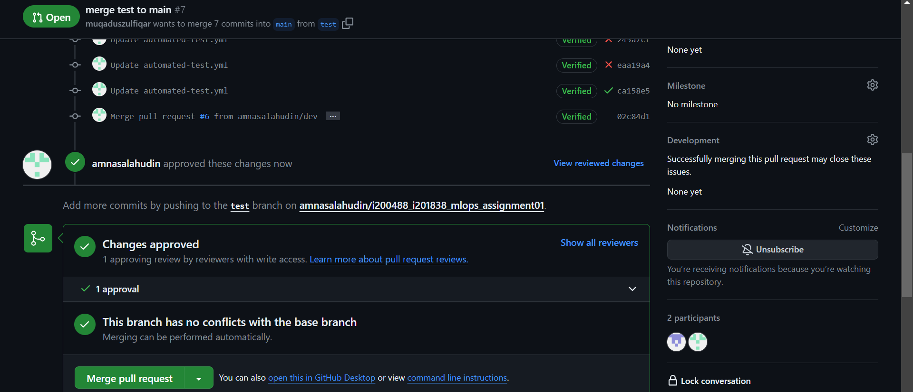

## Sucessful Action Workflow Runs
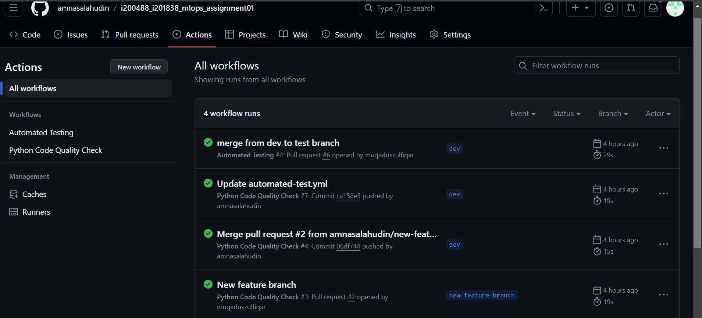

## Sucessful Jenkins Pipeline Run [Checkout, Build and Push Image, Email Notification]
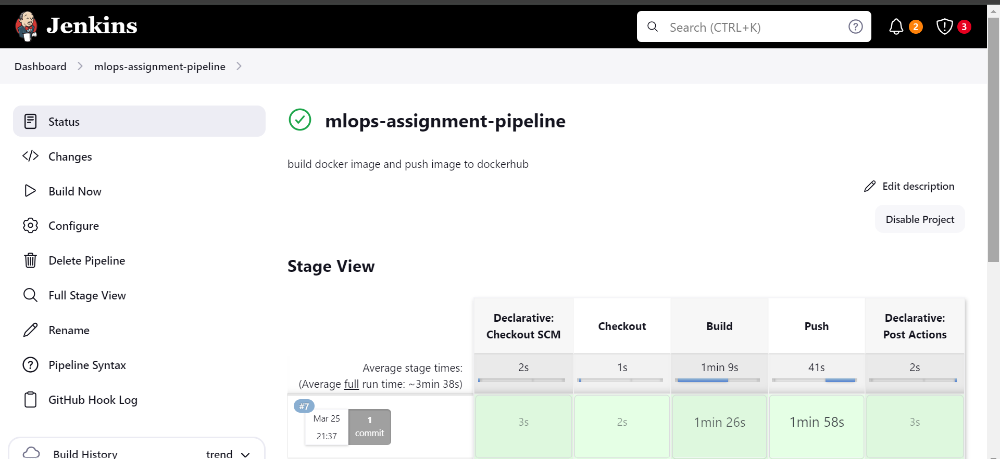

## Pipeline Console Output
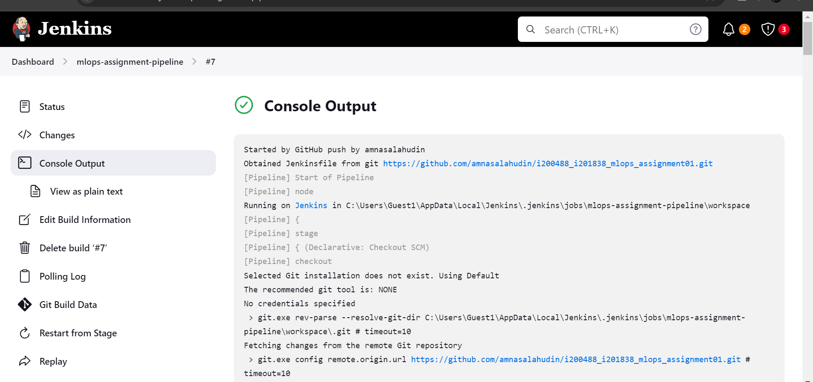

## Docker Image Pushed to Dockerhub
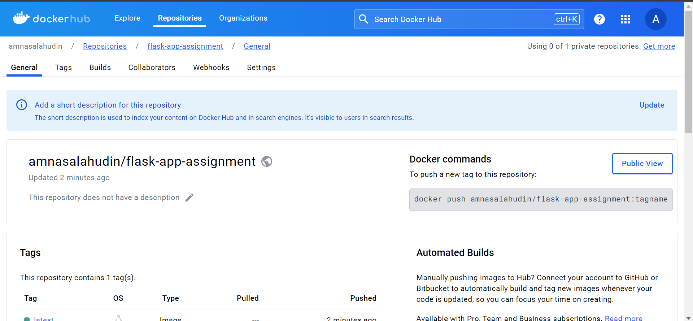

## Email to Admin
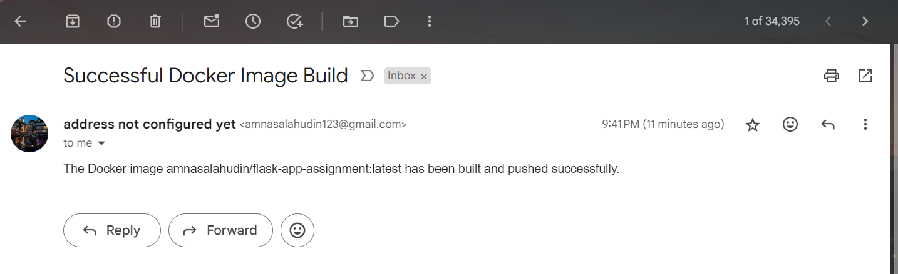

## Docker Container Running
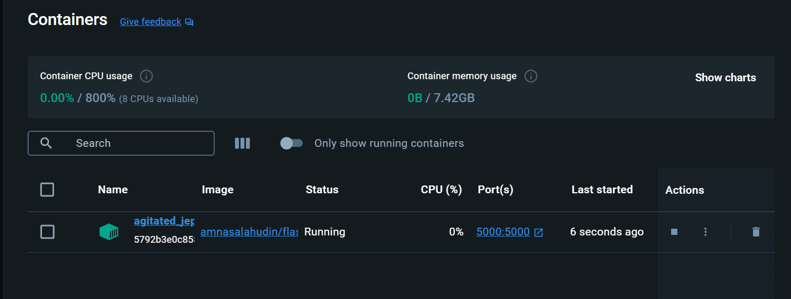

## Flask endpoint prediction response
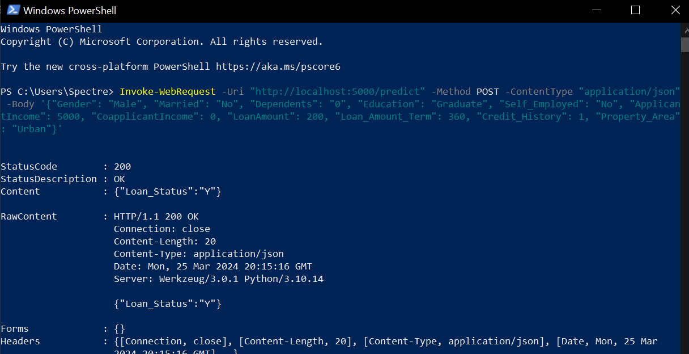

## Docker Container Logs
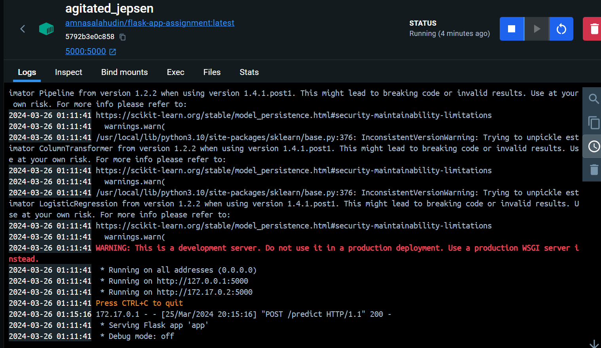
